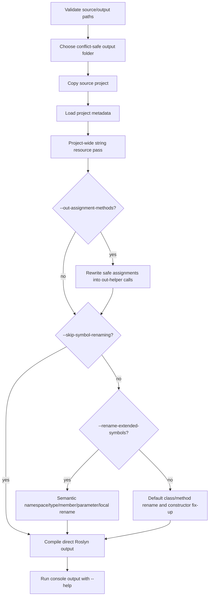

# Loaders

[Russian version](README.ru.md)

Loaders is a .NET Framework 4.8 source-level obfuscation pipeline for C# projects. It copies the input project into an isolated output directory, rewrites the copied sources, embeds one project-wide string resource, compiles the transformed project, and smoke-runs console outputs with `--help`.

## Pipeline



More diagrams are in [docs/protector-pipeline.md](docs/protector-pipeline.md) and [docs/string-resource-pipeline.md](docs/string-resource-pipeline.md).

## Core Behavior

- The source directory must contain exactly one `.csproj`.
- The input project is copied first; Loaders does not obfuscate source files in place.
- If the requested output directory already exists, Loaders chooses a conflict-safe suffix instead of deleting old artifacts.
- C# string literals are handled by one project-wide orchestration pass. Eligible literals are deduplicated, encoded into one binary embedded resource, and rewritten to compact generated loader calls.
- Compile-time constant contexts, generated files, `bin`, `obj`, and obfuscator-generated artifacts are skipped.
- The generated project receives the loader `.g.cs`, the binary `.bin` resource, exact `LogicalName` metadata, and codec runtime references when needed.
- Direct Roslyn `Emit` receives the same loader syntax tree and manifest resource bytes.

## CLI

```text
Loaders.exe --source C:\path\to\source --output C:\path\to\output [options]
```

| Option | Meaning |
| --- | --- |
| `--source <PATH>` | Source directory containing exactly one C# project. |
| `--output <PATH>` | Output root for the copied and transformed project. |
| `--out-assignment-methods` | Rewrite safe local assignments through generated helper methods with `out` parameters. |
| `--rename-extended-symbols` | Use wider Roslyn semantic renaming for namespaces, types, members, parameters, and locals. |
| `--skip-symbol-renaming` | Run project preparation, string obfuscation, and compilation without namespace/type/member renaming. Useful for isolating string-resource validation on large projects. |
| `--BeLeo`, `--be-leo` | Generate obfuscated identifiers from the embedded War and Peace text instead of the default `Microsoft` + hash pattern. |
| `--string-obfuscation-strategy <STRATEGY>` | Force one string codec strategy; omit it for per-literal automatic selection. |

Supported string strategies: `XorBase64`, `LcgBase64`, `GZipBase64`, `GZipLcgBase64`, `HexReverseXor`, `DecimalDelta`, `Utf16DeltaArrays`, `ShuffledUtf16Triplets`, `InterleavedMaskPairs`, `AffineBase64`, `BytePermutation`, `UInt64Packing`, `GuidPacking`, `BigIntegerPacking`, `JunkedBase64`.

## Outputs

Loaders writes artifacts inside the selected output folder:

- transformed `.cs` files and patched `.csproj`;
- `ObfuscationGenerated\StringStore.<id>.g.cs`;
- `ObfuscationGenerated\StringStore.<id>.bin`;
- direct Roslyn output `Output.exe`;
- generated-project build outputs when the copied project is built with MSBuild;
- `logs\`, `metrics\`, `class-map.csv`, and `compilation-errors.log` when produced.

## Build And Run

This repository targets .NET Framework 4.8 and uses the legacy `packages.config` project format. Build from a Visual Studio 2022 Native Tools prompt, preferably x64:

```text
cmd /c "C:\Program Files\Microsoft Visual Studio\2022\Professional\VC\Auxiliary\Build\vcvars64.bat" && msbuild "E:\Documents\GitHub\Loaders\Loaders.sln" /m /p:Configuration=Release /p:Platform=x64 /v:m /nologo
```

Then run:

```text
Loaders.exe --source C:\path\to\source --output C:\path\to\output
```

## Safety Notes

- Default and extended symbol renaming can expose project-specific edge cases in large codebases. Use `--skip-symbol-renaming` when validating only the string-resource pipeline.
- Semantic renaming depends on accurate project metadata references.
- Reflection, serialization, P/Invoke, generated files, and framework contract members are treated conservatively.
- The generated string loader uses a project-local cache and does not call `string.Intern`.

## Detailed Documentation

- [Protector pipeline and flag behavior](docs/protector-pipeline.md)
- [Project-wide string resource pipeline](docs/string-resource-pipeline.md)

## Main Components

- `InMemCompiler`: top-level orchestration, output handling, compilation, and CLI.
- `ProjectStringObfuscator`: project-wide string collection, deduplication, rewrite, loader/resource generation.
- `StringResourceCodecs`: binary payload codecs for all supported string strategies.
- `StringResourceSerializer`: versioned binary resource format.
- `StringResourceLoaderGenerator`: generated runtime loader source.
- `StringResourceProjectPatcher`: idempotent `.csproj` integration.
- `ExtendedSymbolRenameService`, `ClassRenamer`, `MethodRenamer`: symbol rename passes.
- `OutAssignmentMethodService`: optional assignment-to-helper rewrite.
- `Loaders.GAC`: assembly reference discovery.
