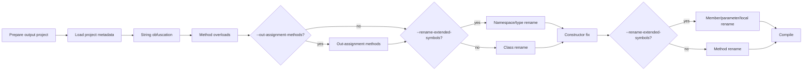

# Loaders

Loaders is a .NET Framework 4.8 obfuscation pipeline: it copies a C# project to a working directory, applies obfuscation steps, then compiles and runs the obfuscated binary.

## Pipeline



## Core process

- **PrepareOutputProject**: copy the source project into an isolated folder.
- **LoadProject**: parse the csproj to collect C# files, assembly references, output type, language version and unsafe settings.
- **String obfuscation**: remove comments and rewrite string literals with automatic or explicit decoder strategies.
- **Overload injection**: add harmless method overloads to increase control-flow noise; extension methods are skipped.
- **Out-assignment methods**: optional `--out-assignment-methods` pass that lifts safe local initializers into generated helper methods with `out var`.
- **Semantic class or extended renaming**: default mode renames classes/methods; `--rename-extended-symbols` widens this to namespaces, types, members, parameters and locals.
- **Syntactic constructor fix-up**: adjust call sites that semantic renaming may miss.
- **Compile**: build the obfuscated assembly in memory and run `--help` only for console executables.

## Semantic vs syntactic renaming

- **Semantic**: operates on Roslyn `ISymbol`, updates usages (type refs, parameters, object creations) reliably. Requires accurate `MetadataReference`.
- **Syntactic**: operates on syntax trees, faster but unaware of symbol binding; can miss or break edge cases.

## Key components

- **`InMemCompiler`**: orchestrates the pipeline.
- **`ClassRenamer`**: semantic class renamer via Roslyn.
- **`MethodRenamer`**: semantic method renamer driven by `MethodRenameEntry`.
- **`ExtendedSymbolRenameService`**: opt-in semantic rename for namespaces, types, members, parameters and locals.
- **`OutAssignmentMethodService`**: opt-in local initializer to helper-method rewrite.
- **`ObfuscatedNameGenerator`**: chooses the default hash provider or the BeLeo provider.
- **`MethodCollectionRewriter`**: collects eligible methods, captures overload info.
- **`SimpleConstructorRenameService`**: focused syntactic constructor pass.
- **`StringLiteralObfuscationService`** and rewriters: string processing and comment removal.
- **`Loaders.GAC`**: resolves assembly references from GAC.

## Best practices

- Run semantic renaming (classes/methods) before syntactic fixes.
- Provide complete `MetadataReference` to the Roslyn workspace (parsed from csproj + common framework libs).
- Centralize exclusion rules (override, interface implementations, extern/DllImport, `Main`, `Dispose`, `ReleaseHandle`, serialization callbacks and `object` methods) in collection.
- Use structured entries (class, method, parameter count, new name) to avoid collisions and handle overloads.
- Persist changes to disk after successful semantic updates and a clean build.

## Rename safety rules

Loaders keeps a conservative non-rename list so semantic rewrites do not break framework, interop or external contracts:

- Generated/designer files are skipped: `AssemblyInfo.cs`, `*.Designer.cs`, `*.g.cs`, `*.g.i.cs`, `*.Generated.cs`.
- Constructors, destructors, operators and accessors are not renamed directly.
- Common contract names are preserved: `Main`, `Dispose`, `ToString`, `GetHashCode`, `Equals`, and SafeHandle `ReleaseHandle`.
- `override`, `extern`, `[DllImport]`, P/Invoke and serialization callback methods are skipped.
- Members implementing interface contracts are skipped when Roslyn identifies them through `FindImplementationForInterfaceMember`.
- Reflection/serialization-sensitive symbols with JSON, XML, DataContract, Newtonsoft, MessagePack, Proto/YAML and CLI option attributes are skipped.
- SafeHandle-derived types may still be renamed, but mandatory framework members such as `ReleaseHandle()` and `IsInvalid` keep their original names.
- Out-assignment helpers get their generated name when created and are skipped by later method/member rename when `--out-assignment-methods` is active.

## Build & run

- Restore the legacy `packages.config` project and build it from the Visual Studio Native Tools Command Prompt.
- Run the app with the required source and output directories:

```text
Loaders.exe --source C:\path\to\source --output C:\path\to\output
```

- Optional flags:
  - `--out-assignment-methods`: rewrite safe local declarations such as `var dto = (ErrorDTO)result;` to generated helper calls with `out var`.
  - `--rename-extended-symbols`: enable the wider semantic rename scope for namespaces, classes, structs, interfaces, enums, enum members, delegates, methods, properties, fields, events, parameters and locals.
  - `--BeLeo`: generate obfuscated names from the embedded plain-text War and Peace resource instead of the default `Microsoft` + hash pattern. This changes only the name provider; it does not widen rename scope by itself.
  - `--string-obfuscation-strategy <STRATEGY>`: force one string decoder strategy; omit it for per-literal auto selection. Valid values are `XorBase64`, `LcgBase64`, `GZipBase64`, `GZipLcgBase64`, `HexReverseXor`, `DecimalDelta`, `Utf16DeltaArrays`, `ShuffledUtf16Triplets`, `InterleavedMaskPairs`, `AffineBase64`, `BytePermutation`, `UInt64Packing`, `GuidPacking`, `BigIntegerPacking`, and `JunkedBase64`.
- The source directory must contain exactly one `.csproj` file.
- Source and output directories must be separate; output is recreated for each run.
- File-based stages display percentage progress. Roslyn symbol renaming and compilation display a live status.
- `class-map.csv` and `compilation-errors.log` are written inside the output directory.
- Use `Loaders.exe --help` for the generated command-line help.

## Codecepticon scope comparison

| Scope | Codecepticon C# rename | Loaders default | Loaders `--rename-extended-symbols` |
| --- | --- | --- | --- |
| Namespaces | Yes | No | Yes |
| Classes | Yes | Yes | Yes |
| Structs | Yes | No | Yes |
| Interfaces | Collected as interface contracts for skips | No | Yes, as types |
| Enums and enum members | Yes | No | Yes |
| Delegates | Renamed through function mapping | No | Yes |
| Methods/functions | Yes, with override/external/interface skips | Yes, conservative method pass | Yes, semantic member pass |
| Properties | Yes, with override/interface skips | No | Yes |
| Fields/events | Variables are collected syntactically | No | Yes |
| Parameters | Yes | No | Yes |
| Locals | Variables are collected syntactically | No | Yes |
