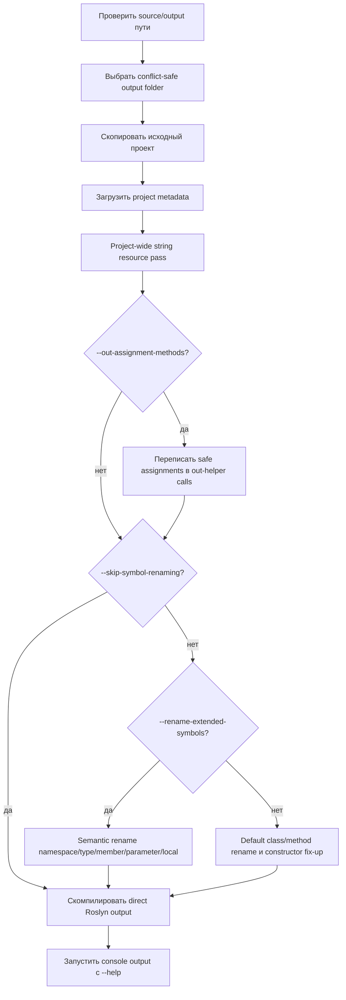

# Loaders

[English version](README.md)

Loaders - это source-level конвейер обфускации C# проектов для .NET Framework 4.8. Он копирует входной проект в изолированный output-каталог, переписывает скопированные исходники, встраивает один project-wide ресурс строк, компилирует преобразованный проект и для консольных output запускает smoke-run с `--help`.

## Конвейер



Больше диаграмм находится в [docs/protector-pipeline.ru.md](docs/protector-pipeline.ru.md) и [docs/string-resource-pipeline.ru.md](docs/string-resource-pipeline.ru.md).

## Основное Поведение

- Source-каталог должен содержать ровно один `.csproj`.
- Входной проект сначала копируется; Loaders не обфусцирует исходные файлы in place.
- Если запрошенный output-каталог уже существует, Loaders выбирает conflict-safe суффикс вместо удаления старых артефактов.
- C# string literals обрабатываются одним project-wide orchestration pass. Eligible literals дедуплицируются, кодируются в один binary embedded resource и переписываются в компактные вызовы generated loader.
- По умолчанию одна string codec strategy выбирается случайно один раз на проект. Передайте `--string-obfuscation-strategy random`, чтобы выбирать codec отдельно для каждой уникальной строки, или concrete strategy name, чтобы принудительно использовать один codec.
- Compile-time constant contexts, generated files, `bin`, `obj` и generated artifacts самого обфускатора пропускаются.
- Generated project получает loader `.g.cs`, binary `.bin` resource, точный `LogicalName` metadata и runtime references для codec, если они нужны.
- Direct Roslyn `Emit` получает тот же loader syntax tree и manifest resource bytes.

## CLI

```text
Loaders.exe --source C:\path\to\source --output C:\path\to\output [options]
```

| Опция | Значение |
| --- | --- |
| `--source <PATH>` | Source-каталог, содержащий ровно один C# проект. |
| `--output <PATH>` | Output root для скопированного и преобразованного проекта. |
| `--out-assignment-methods` | Переписать safe local assignments через generated helper methods с `out` parameters. |
| `--rename-extended-symbols` | Включить более широкий Roslyn semantic rename для namespaces, types, members, parameters и locals. |
| `--skip-symbol-renaming` | Выполнить project preparation, string obfuscation и compilation без namespace/type/member renaming. Полезно для изоляции string-resource validation на больших проектах. |
| `--BeLeo`, `--be-leo` | Генерировать obfuscated identifiers из embedded текста War and Peace вместо default `Microsoft` + hash pattern. |
| `--string-obfuscation-strategy <STRATEGY>` | Принудительно выбрать одну string codec strategy; если опция не задана, одна случайная strategy выбирается на весь проект; `random` включает выбор per unique string. |

Поддерживаемые значения string strategy: `random`, `XorBase64`, `LcgBase64`, `GZipBase64`, `GZipLcgBase64`, `HexReverseXor`, `DecimalDelta`, `Utf16DeltaArrays`, `ShuffledUtf16Triplets`, `InterleavedMaskPairs`, `AffineBase64`, `BytePermutation`, `UInt64Packing`, `GuidPacking`, `BigIntegerPacking`, `JunkedBase64`.

## Выходные Артефакты

Loaders пишет артефакты внутри выбранного output folder:

- преобразованные `.cs` файлы и patched `.csproj`;
- `ObfuscationGenerated\StringStore.<id>.g.cs`;
- `ObfuscationGenerated\StringStore.<id>.bin`;
- direct Roslyn output `Output.exe`;
- build outputs generated project, если скопированный проект собирается через MSBuild;
- `logs\`, `metrics\`, `class-map.csv` и `compilation-errors.log`, если они были созданы.

## Сборка И Запуск

Этот репозиторий таргетит .NET Framework 4.8 и использует legacy `packages.config` project format. Собирать следует из Visual Studio 2022 Native Tools prompt, желательно x64:

```text
cmd /c "C:\Program Files\Microsoft Visual Studio\2022\Professional\VC\Auxiliary\Build\vcvars64.bat" && msbuild "E:\Documents\GitHub\Loaders\Loaders.sln" /m /p:Configuration=Release /p:Platform=x64 /v:m /nologo
```

Затем запуск:

```text
Loaders.exe --source C:\path\to\source --output C:\path\to\output
```

## Примечания По Безопасности

- Default и extended symbol renaming могут выявлять project-specific edge cases в больших codebases. Используйте `--skip-symbol-renaming`, когда нужно проверить только string-resource pipeline.
- Semantic renaming зависит от точных project metadata references.
- Reflection, serialization, P/Invoke, generated files и framework contract members обрабатываются консервативно.
- Generated string loader использует project-local cache и не вызывает `string.Intern`.

## Подробная Документация

- [Конвейер протектора и поведение флагов](docs/protector-pipeline.ru.md)
- [Project-wide конвейер строкового ресурса](docs/string-resource-pipeline.ru.md)

## Основные Компоненты

- `InMemCompiler`: top-level orchestration, output handling, compilation и CLI.
- `ProjectStringObfuscator`: project-wide сбор строк, deduplication, rewrite, loader/resource generation.
- `StringResourceCodecs`: binary payload codecs для всех поддерживаемых string strategies.
- `StringResourceSerializer`: versioned binary resource format.
- `StringResourceLoaderGenerator`: source-код generated runtime loader.
- `StringResourceProjectPatcher`: idempotent `.csproj` integration.
- `ExtendedSymbolRenameService`, `ClassRenamer`, `MethodRenamer`: symbol rename passes.
- `OutAssignmentMethodService`: optional assignment-to-helper rewrite.
- `Loaders.GAC`: поиск assembly references.
