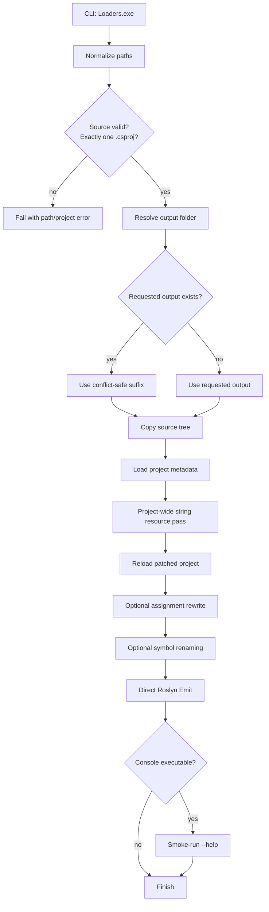
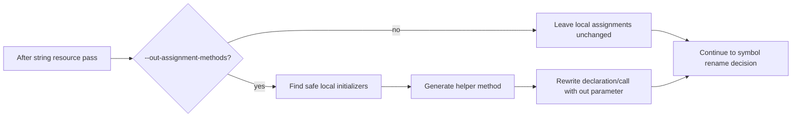
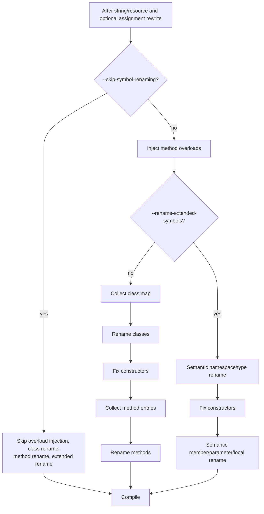
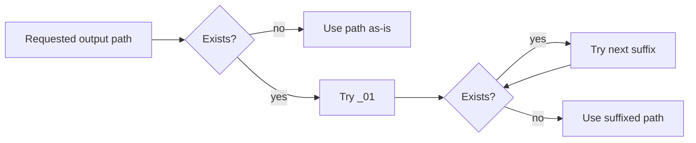

# Protector Pipeline And Flags

[Russian version](protector-pipeline.ru.md)

This document expands the short pipeline shown in the README. It focuses on how the protector changes behavior based on CLI flags.

## Top-Level Flow

## Assignment Rewrite Flag

`--out-assignment-methods` runs before symbol renaming. Later member/method renaming skips generated out-assignment helpers when this flag is active.

## Symbol Rename Modes

## Output Folder Behavior

The protector does not delete previous output roots. If the requested output exists, it appends a numeric suffix and reports the actual path.

## Flag Matrix

| Flags | String resource | Assignment rewrite | Symbol rename | Notes |
| --- | --- | --- | --- | --- |
| none | Yes | No | Default class/method flow | Original broad obfuscation path, but symbol rename can be project-sensitive. |
| `--out-assignment-methods` | Yes | Yes | Default class/method flow | Generated helpers are skipped by later method/member rename. |
| `--rename-extended-symbols` | Yes | Optional | Extended semantic flow | Wider scope; depends heavily on complete metadata references. |
| `--skip-symbol-renaming` | Yes | Optional | No | Best for validating project-wide string resource behavior separately. |
| `--BeLeo` | Yes | Optional | Depends on other flags | Changes name provider only. |
| `--string-obfuscation-strategy <STRATEGY>` | Yes | Optional | Depends on other flags | Forces one string codec instead of automatic per-literal selection. |

## Rename Scope Comparison

| Scope | Default mode | `--rename-extended-symbols` | `--skip-symbol-renaming` |
| --- | --- | --- | --- |
| Namespaces | No | Yes | No |
| Classes | Yes | Yes | No |
| Structs/interfaces/enums/delegates | No | Yes | No |
| Methods | Yes | Yes | No |
| Properties/fields/events | No | Yes | No |
| Parameters/locals | No | Yes | No |
| Constructors/accessors/operators | Not renamed directly | Not renamed directly | No |
| Generated/designer files | Skipped | Skipped | Skipped |

## Known Boundary

The string-resource pass is independent from symbol renaming. Large projects can compile successfully with `--skip-symbol-renaming` while still exposing existing rename edge cases in default or extended rename modes. Treat `--skip-symbol-renaming` as a validation and isolation tool, not as a replacement for rename hardening.
