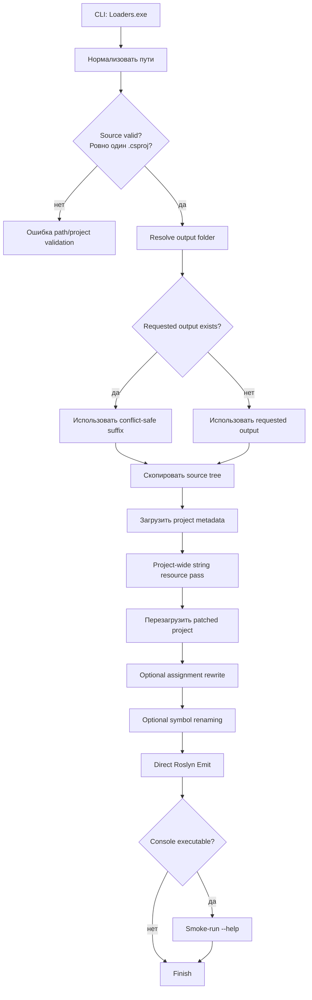
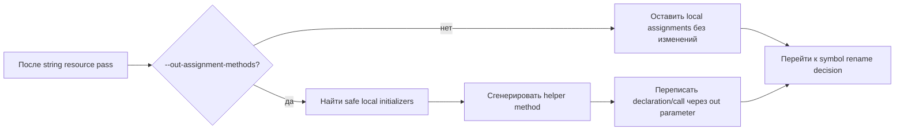
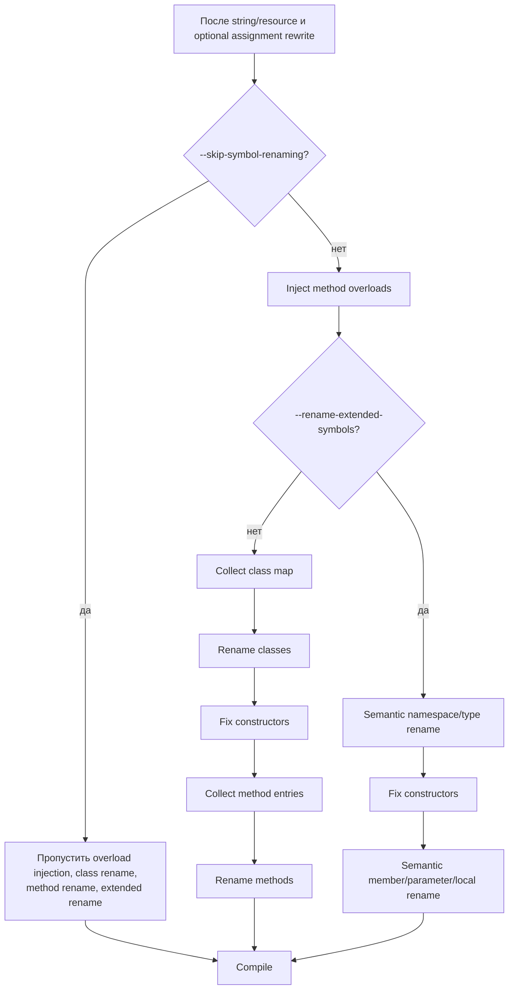
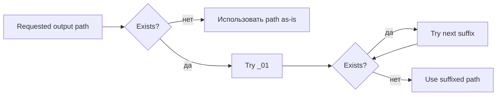

# Конвейер Протектора И Флаги

[English version](protector-pipeline.md)

Этот документ раскрывает короткую диаграмму из README. Он описывает, как поведение протектора меняется в зависимости от CLI-флагов.

## Общий Flow

## Флаг Assignment Rewrite

`--out-assignment-methods` выполняется до symbol renaming. Если флаг активен, последующий member/method renaming пропускает generated out-assignment helpers.

## Режимы Symbol Rename

## Поведение Output Folder

Протектор не удаляет предыдущие output roots. Если requested output уже существует, он добавляет numeric suffix и сообщает фактический путь.

## Матрица Флагов

| Флаги | String resource | Assignment rewrite | Symbol rename | Notes |
| --- | --- | --- | --- | --- |
| нет | Да | Нет | Default class/method flow | Исходный широкий obfuscation path, но symbol rename может зависеть от особенностей проекта. |
| `--out-assignment-methods` | Да | Да | Default class/method flow | Generated helpers пропускаются последующим method/member rename. |
| `--rename-extended-symbols` | Да | Optional | Extended semantic flow | Более широкий scope; сильно зависит от полных metadata references. |
| `--skip-symbol-renaming` | Да | Optional | Нет | Лучший режим для отдельной проверки project-wide string resource behavior. |
| `--BeLeo` | Да | Optional | Зависит от других флагов | Меняет только name provider. |
| `--string-obfuscation-strategy <STRATEGY>` | Да | Optional | Зависит от других флагов | Принудительно выбирает один string codec вместо automatic per-literal selection. |

## Сравнение Rename Scope

| Scope | Default mode | `--rename-extended-symbols` | `--skip-symbol-renaming` |
| --- | --- | --- | --- |
| Namespaces | Нет | Да | Нет |
| Classes | Да | Да | Нет |
| Structs/interfaces/enums/delegates | Нет | Да | Нет |
| Methods | Да | Да | Нет |
| Properties/fields/events | Нет | Да | Нет |
| Parameters/locals | Нет | Да | Нет |
| Constructors/accessors/operators | Не переименуются напрямую | Не переименуются напрямую | Нет |
| Generated/designer files | Пропускаются | Пропускаются | Пропускаются |

## Известная Граница

String-resource pass независим от symbol renaming. Большие проекты могут успешно компилироваться с `--skip-symbol-renaming`, но при этом выявлять уже существующие edge cases в default или extended rename modes. Используйте `--skip-symbol-renaming` как validation/isolation tool, а не как замену hardening для rename passes.
