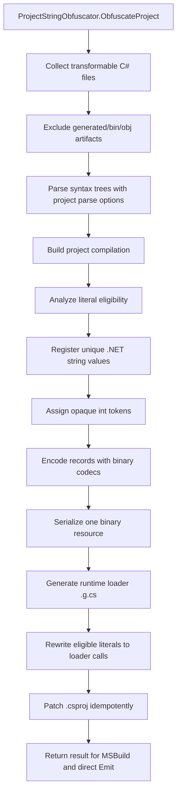
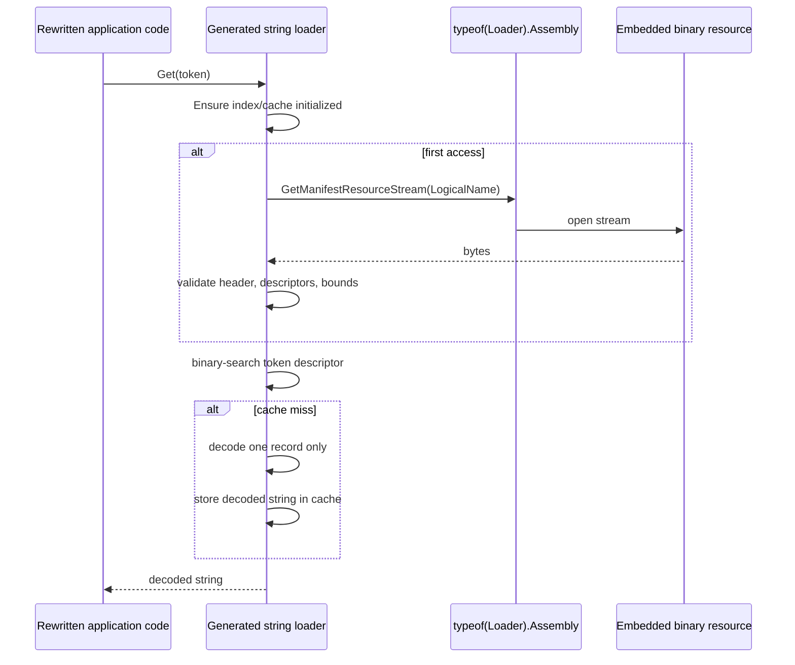
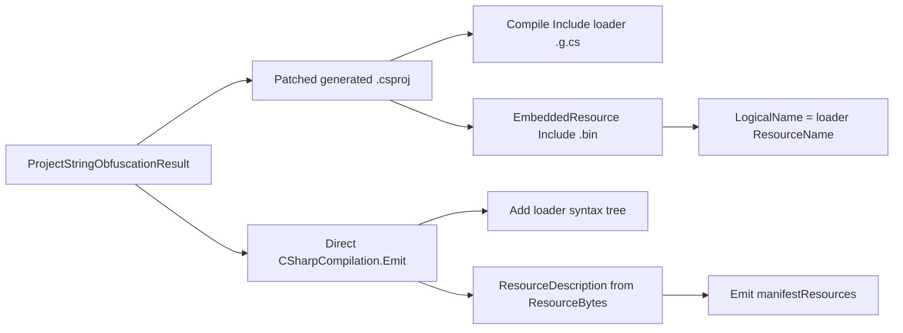

# Project-Wide String Resource Pipeline

[Russian version](string-resource-pipeline.ru.md)

This document describes the string-obfuscation architecture used by Loaders after the project-wide resource migration.

## Goal

The protector makes one project-level string-obfuscation call. That call returns rewritten sources, generated loader source, one binary embedded resource, the manifest resource name, diagnostics, statistics, and direct Roslyn `Emit` data.

## End-To-End Flow



## Runtime Lookup



## Resource Format V1

The manifest resource is binary; it does not use Base64 as a container.

| Region | Contents |
| --- | --- |
| Header | `Magic`, `FormatVersion`, flags, record count, descriptor offset/length, metadata offset/length, payload offset/length. |
| Descriptor table | One fixed-size descriptor per string record. |
| Metadata region | Codec-specific metadata, such as seeds, masks, permutations, lengths, or packing metadata. |
| Payload region | Encoded binary payload bytes. |

Each descriptor stores:

| Field | Meaning |
| --- | --- |
| Token | Opaque `int` used at rewritten call sites. |
| Cache index | Slot in the generated loader cache. |
| Codec id | Runtime decoder selector. |
| Record flags | Reserved/per-record flags. |
| Decoded char length | Expected UTF-16 code-unit length. |
| Metadata offset/length | Slice inside the metadata region. |
| Payload offset/length | Slice inside the payload region. |
| Checksum | FNV-1a checksum over encoded record bytes. |

The loader validates magic, version, region bounds, descriptor bounds, checksum, and decoded length before returning strings.

## Rewritten Source Shape

Eligible literals become fully qualified generated-loader calls:

```csharp
global::__GeneratedNamespace.__StringStoreType.Get(unchecked((int)0x12345678))
```

The generated source contains decoder code and small constants only. String payload bytes live in the embedded `.bin` resource.

## MSBuild And Direct Emit Integration



The stream factory used by `ResourceDescription` creates a fresh readable `MemoryStream` for every emit request.

## Codec Strategy Table

| Strategy | Old source container style | New resource representation | Runtime decoder |
| --- | --- | --- | --- |
| `XorBase64` | Base64 string payload | XORed bytes + key metadata | XOR decoder |
| `LcgBase64` | Base64 string payload | LCG-masked bytes + seed metadata | LCG decoder |
| `GZipBase64` | Base64 compressed payload | GZip bytes, kept only when useful | GZip decoder |
| `GZipLcgBase64` | Base64 compressed/masked payload | GZip before LCG mask | GZip + LCG decoder |
| `HexReverseXor` | Hex string payload | Reversed XORed bytes | Reverse + XOR decoder |
| `DecimalDelta` | Decimal text deltas | Binary deltas | Delta decoder |
| `Utf16DeltaArrays` | Numeric arrays | Binary UTF-16 deltas | UTF-16 delta decoder |
| `ShuffledUtf16Triplets` | Numeric triplet arrays | Binary triplet records | Triplet restore decoder |
| `InterleavedMaskPairs` | Numeric pair arrays | Binary interleaved pairs | Pair unmask decoder |
| `AffineBase64` | Base64 affine bytes | Affine-transformed bytes + metadata | Affine inverse decoder |
| `BytePermutation` | Numeric byte array | Permuted bytes + permutation metadata | Permutation decoder |
| `UInt64Packing` | `ulong[]` payload | Packed binary words | UInt64 unpack decoder |
| `GuidPacking` | GUID array payload | Packed GUID-shaped bytes | GUID unpack decoder |
| `BigIntegerPacking` | Decimal `BigInteger` text | Raw packed bytes + sentinel metadata | Packed byte decoder |
| `JunkedBase64` | Base64 with junk markers | Binary payload with junk metadata | Junk-strip decoder |

Current codecs do not add NuGet packages. The codec contract can declare assembly references or packages for future AES/crypto codecs.

## Semantic Safety Rules

The string pass uses Roslyn syntax and semantic context. It uses `SyntaxToken.ValueText` for string values and skips contexts that require compile-time constants or are uncertain:

- `const` fields and locals;
- attribute arguments, including interop attributes;
- default parameter values;
- `case` labels and `goto case`;
- constant patterns;
- generated files and obfuscator artifacts;
- expression-tree or non-string interpolation targets when unsafe.

Interpolated strings are rewritten only when the target is a normal `string` context. Formatting, alignment, escaped braces, and evaluation order are preserved through a resource-backed composite format and `string.Format(CultureInfo.CurrentCulture, ...)`.

## Diagnostics And Metrics

The pipeline records:

- literal occurrences;
- rewritten and skipped counts;
- skip reasons;
- unique string count;
- deduplicated occurrence count;
- codec usage;
- loader size;
- resource size;
- obfuscation time;
- generated paths and manifest resource name.

## Limits

- Non-C# sources such as `.resx`, XAML, JSON, XML, config files, and embedded data files are outside the current string pass.
- Format version is `1`; backward compatibility with older resource layouts is not required yet.
- The loader uses a project-local cache and does not call `string.Intern`.
