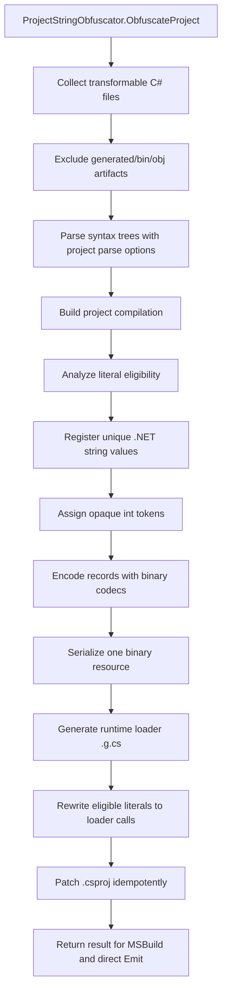
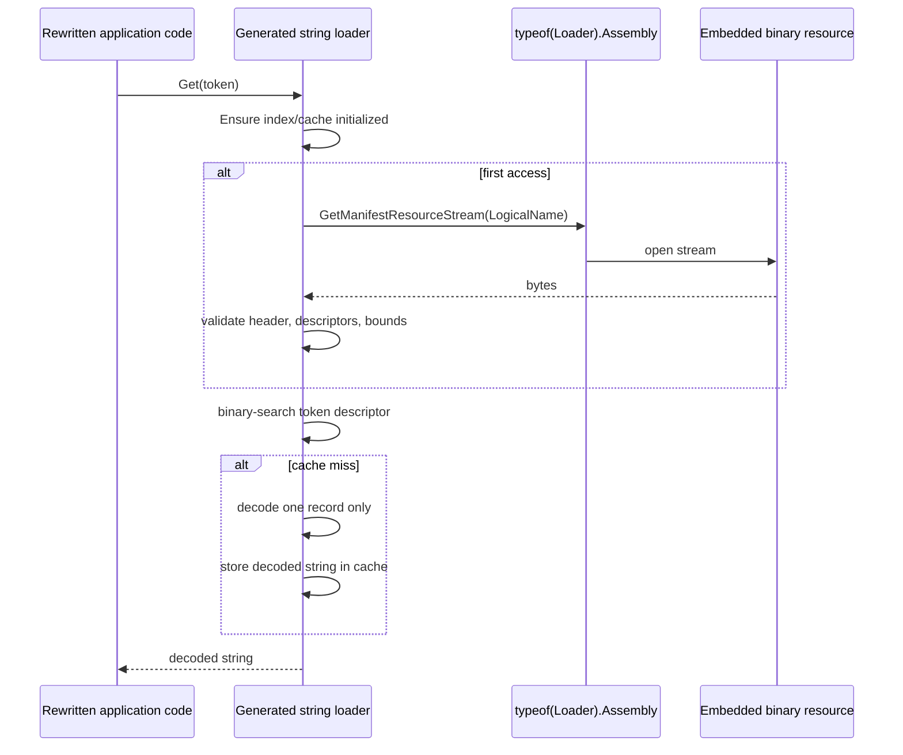
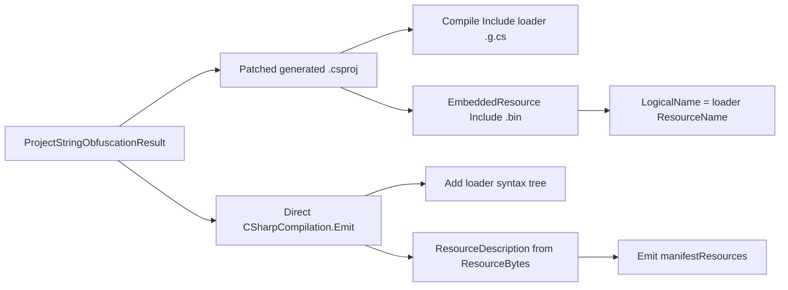

# Project-Wide String Resource Pipeline

[English version](string-resource-pipeline.md)

Этот документ описывает архитектуру string obfuscation в Loaders после миграции на project-wide resource.

## Цель

Протектор выполняет один project-level string-obfuscation call. Этот вызов возвращает rewritten sources, generated loader source, один binary embedded resource, manifest resource name, diagnostics, statistics и данные для direct Roslyn `Emit`.

## End-To-End Flow



## Runtime Lookup



## Формат Resource V1

Manifest resource является binary; Base64 не используется как контейнер.

| Region | Contents |
| --- | --- |
| Header | `Magic`, `FormatVersion`, flags, record count, descriptor offset/length, metadata offset/length, payload offset/length. |
| Descriptor table | Один fixed-size descriptor на string record. |
| Metadata region | Codec-specific metadata: seeds, masks, permutations, lengths или packing metadata. |
| Payload region | Encoded binary payload bytes. |

Каждый descriptor хранит:

| Field | Meaning |
| --- | --- |
| Token | Opaque `int`, используемый в rewritten call sites. |
| Cache index | Slot в generated loader cache. |
| Codec id | Runtime decoder selector. |
| Record flags | Reserved/per-record flags. |
| Decoded char length | Ожидаемая длина UTF-16 code units. |
| Metadata offset/length | Slice внутри metadata region. |
| Payload offset/length | Slice внутри payload region. |
| Checksum | FNV-1a checksum over encoded record bytes. |

Loader валидирует magic, version, region bounds, descriptor bounds, checksum и decoded length перед возвратом строки.

## Форма Rewritten Source

Eligible literals превращаются в fully qualified generated-loader calls:

```csharp
global::__GeneratedNamespace.__StringStoreType.Get(unchecked((int)0x12345678))
```

Generated source содержит decoder code и small constants only. String payload bytes находятся в embedded `.bin` resource.

## Интеграция MSBuild И Direct Emit



Stream factory для `ResourceDescription` создает новый readable `MemoryStream` для каждого emit request.

## Таблица Codec Strategies

| Strategy | Old source container style | New resource representation | Runtime decoder |
| --- | --- | --- | --- |
| `XorBase64` | Base64 string payload | XORed bytes + key metadata | XOR decoder |
| `LcgBase64` | Base64 string payload | LCG-masked bytes + seed metadata | LCG decoder |
| `GZipBase64` | Base64 compressed payload | GZip bytes, kept only when useful | GZip decoder |
| `GZipLcgBase64` | Base64 compressed/masked payload | GZip before LCG mask | GZip + LCG decoder |
| `HexReverseXor` | Hex string payload | Reversed XORed bytes | Reverse + XOR decoder |
| `DecimalDelta` | Decimal text deltas | Binary deltas | Delta decoder |
| `Utf16DeltaArrays` | Numeric arrays | Binary UTF-16 deltas | UTF-16 delta decoder |
| `ShuffledUtf16Triplets` | Numeric triplet arrays | Binary triplet records | Triplet restore decoder |
| `InterleavedMaskPairs` | Numeric pair arrays | Binary interleaved pairs | Pair unmask decoder |
| `AffineBase64` | Base64 affine bytes | Affine-transformed bytes + metadata | Affine inverse decoder |
| `BytePermutation` | Numeric byte array | Permuted bytes + permutation metadata | Permutation decoder |
| `UInt64Packing` | `ulong[]` payload | Packed binary words | UInt64 unpack decoder |
| `GuidPacking` | GUID array payload | Packed GUID-shaped bytes | GUID unpack decoder |
| `BigIntegerPacking` | Decimal `BigInteger` text | Raw packed bytes + sentinel metadata | Packed byte decoder |
| `JunkedBase64` | Base64 with junk markers | Binary payload with junk metadata | Junk-strip decoder |

Текущие codecs не добавляют NuGet packages. Codec contract умеет объявлять assembly references или packages для будущих AES/crypto codecs.

## Semantic Safety Rules

String pass использует Roslyn syntax и semantic context. Для значений строк используется `SyntaxToken.ValueText`; контексты, требующие compile-time constants или дающие uncertain semantics, пропускаются:

- `const` fields и locals;
- attribute arguments, включая interop attributes;
- default parameter values;
- `case` labels и `goto case`;
- constant patterns;
- generated files и obfuscator artifacts;
- expression-tree или non-string interpolation targets, если rewrite небезопасен.

Interpolated strings переписываются только в обычном `string` context. Formatting, alignment, escaped braces и evaluation order сохраняются через resource-backed composite format и `string.Format(CultureInfo.CurrentCulture, ...)`.

## Diagnostics And Metrics

Pipeline записывает:

- literal occurrences;
- rewritten и skipped counts;
- skip reasons;
- unique string count;
- deduplicated occurrence count;
- codec usage;
- loader size;
- resource size;
- obfuscation time;
- generated paths и manifest resource name.

## Ограничения

- Non-C# sources: `.resx`, XAML, JSON, XML, config files и embedded data files сейчас вне string pass.
- Format version равен `1`; backward compatibility со старыми resource layouts пока не требуется.
- Loader использует project-local cache и не вызывает `string.Intern`.
